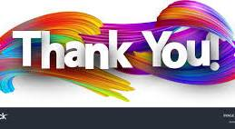

# Enhancing Version Control Skills through Coursera 

 # * Tag 1 *  This is a blockquote
> I'm currently enrolled in a Coursera course offered by the University of Leeds, aiming to enhance my proficiency in version control. Through this comprehensive curriculum, I anticipate gaining valuable insights and practical skills in utilizing version control tools effectively.
 # * Tag 2 *  This is a Heading 2
## Hopefully I will from this course new things and upgrade my key skill **Version Controle**.
 # * Tag 3 *  This is a heading 3
### What I cover in this course are
 # * Tag 4 *  in this un unordered list
- Basic Sanytax in Version Controlle
- How uppdate , commit , delete, and margin file in deffernt branching.
- Additionally, how to fork anothere repo.

---
# Addtionaly, here are some basic version control syntax commands for Git
 # * Tag 5 *  This is an ordered list
1. **git init:** Initializes a new Git repository.
2. **git add \<filename>:** Adds a file to the staging area.
3. **git commit -m\ "<message>"**: Commits the changes in the staging area to the repository and adds a message describing the changes.'
4. **git status**: Shows the status of your working directory, staging area, and repository.
5. **git checkout \<branch>**: Switches to the specified branch.
6. **git branch**: Lists all the branches in your repository.
7. 
---
 # * Tag 6 *
 ###### Adding images

<figure>
    
    <figcaption>WOOOOO.</figcaption>
</figure>

***

> You're welcome! Thank you for your kind feedback. I'm always striving to improve my abilities, and your feedback helps me to do that. Please let me know if you have any other questions or requests.

